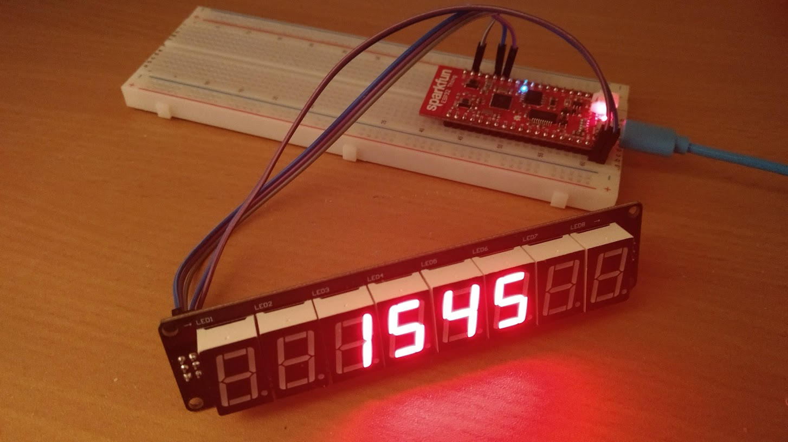

# ESP32 NTP clock demo application

Connect to a NTP server.
Get time from the NTP server.
Display time HH:MM on a 3-wire 7 segment LED module.
The module consist of a shift register and a latch and uses only 3 wires (Clock, Data, Latch).

## Requirements

* ESP32 lolin32 module
* PlatformIO Rapid Embedded Development.
* 3-Wire LED Module (SKU:DFR0090)

## Documentation links

* The [Arduino](https://www.arduino.cc/) website.
* [PlatformIO](http://platformio.org/) Rapid Embedded Development.
* DFRobot [8 digit 7 segment led module](https://www.dfrobot.com/wiki/index.php/3-Wire_LED_Module_(SKU:DFR0090))
* Datasheet [74HC595](http://www.ti.com/lit/ds/symlink/sn74hc595.pdf)
